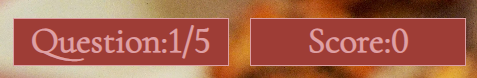
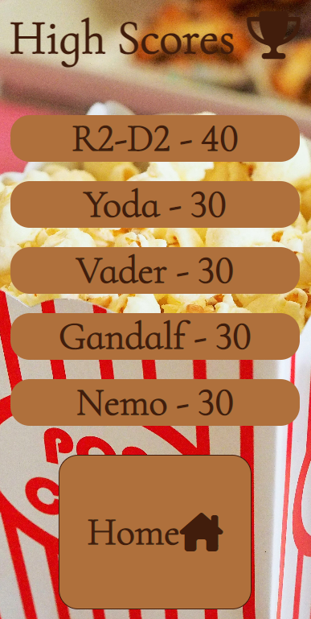
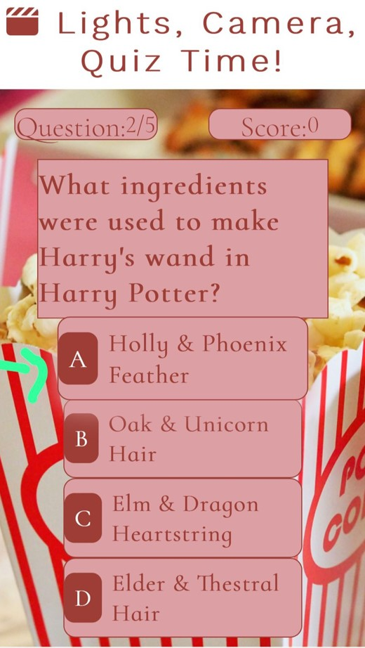
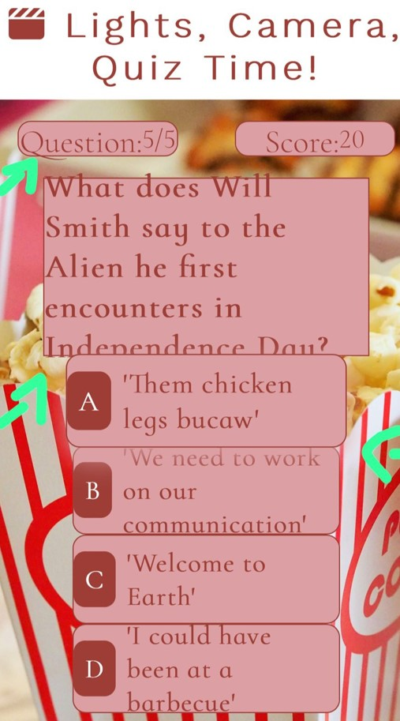
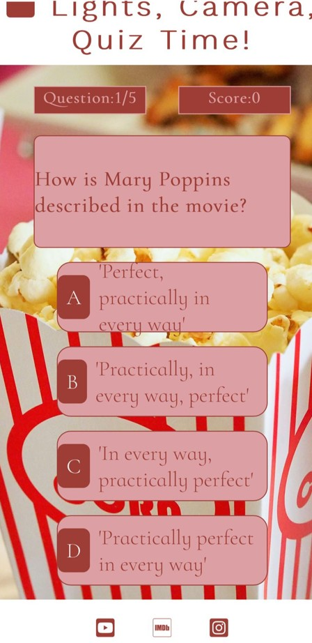
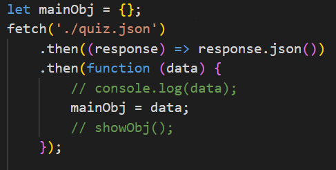
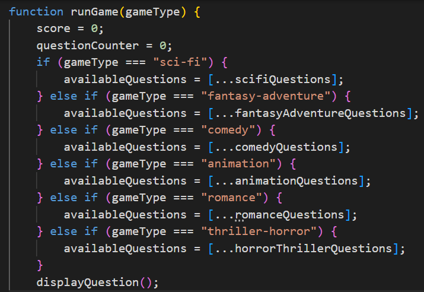

# Lights, Camera, Quiz Time

This website provides an interactive quiz with 6 different categories of movie genre for the user to choose from. The user will be asked 5 questions in each category out of a possible bank of ten questions for each genre. There are four options displayed for each question. As the player progresses through the game their score is displayed and updated in the heads up display and they have option to save their score after completing each category.

View the live website [here](https://louiseconlon11.github.io/lights-camera-quiz-time/)

## User experience
### User Stories
- First Time Vistor Goals
1. I want to play an interactive game where I can see which options are correct and incorrect.
2. I want to see my score displayed as I play through the game.
3. I want to ensure the site is reliable and the author is a trusted source.

- Returning Visitor Goals
1. I want to play other categories I did not play on the first visit.
2. I want to beat my original score in each category.
3. I want to access the author's social media accounts to see any other interactive games the author has designed.

- Frequent User Goals
1. I want to replay each of the categories to see have I answered all possible questions.
2. I want to check have other users beaten my top score.
3. I want to check the social media blog posts to see are there any future features being implemented.

- Owner Goal
1. I want to provide a fun and engaging interactive game for users.
2. I want to provide a wide range of questions from a variety of movie genres to engage players of all ages and interests.
3. I want to develop an online presence showcasing my expertise in the area of interactive game design.

### Design

#### Color Scheme

The main colors used are Rosy Brown, Copper, Auburn, Seal brown and Raw umber. The color scheme was chosen by uploading the popcorn main image to the [coolors](https://coolors.co/) website and choosing a selection of the colors identified in the popcorn image.

#### Typography
I used [Fontjoy](https://fontjoy.com/) to choose a pairing of the fonts. I choose Work Sans 300 for headings and Cormorant Infant 300 for the body. I used [GoogleFonts](https://fonts.google.com/) for the import link. I used sans-serif as the back-up text font for accessibility.

#### Imagery
The popcorn main image was sourced from [Pixabay](https://pixabay.com/) from [Pexels](https://www.pexels.com/) [Image Source](https://www.pexels.com/photo/food-snack-popcorn-movie-theater-33129/).

#### Wireframes
- 
- 
- 

### Existing Features
#### Heading

The heading displays the title of the movie quiz to the user and has an anchor embedded so that when clicked the user returns to the home screen. This provides value to the user as the user can return to the home page with ease from any of the screens.

#### Categories

There are siz categories for the user to choose from. This provides value to the user as many different genres of film are included for the user to choose from. Each of the buttons has a transition hover effect that evokes a positive visual response from the user.

#### The Footer

There are links to social media sites for the user to interact with in the footer on each screen. The links open in an external tab which removes the necessity to click the back button. The inclusion of this feature provides value to the user as they can access the author's social media pages to gain insight into the author and confirm the site is a credible and reliable source.

#### Game Screen

Once the user choses a category they are navigated to the game screen where there is a question and 4 possible options displated to the user. This provides value as the user has options to aid them in answering the question. The addition of the green and red background colors for correct and incorrect selected answers provides the user with a visual stimulus and indication of their progress in the quiz.

#### Heads Up Display

The heads up display includes the question the user is currently on and displays the score to the user. The score implements when a user gets a correct answer which is also signified by the temporary green background color which displays on the answer box selected. This provides value to the user as it is clear the number of questions they have completed and whether they were successful in answering the questions in the chosen category.

#### End Screen

When the user completes the max number of questions they are navigated to the end screen where their score is displayed. The user has the option to complete the form input with their name and save their result or they have the option to return to the home screen and choose another category. If the user chooses to save their score they are then naviagted to a high scores screen where the top 5 high scores are displayed. This provides value to the user as they have the option to save their score if they are happy with their result and encourages competition amongst users to achieve the highest possible score.

#### High Scores Screen

The high scores screen displays the top 5 results including the score and the user who achieved the score. The current user can view the results and determine if they have been successful to reach the high scores board. There is also a home button where the user can return to the categories home screen. This screen provides value as it gives a sense of achievement to users and fosters ambition for improvement.

### Acessibility
- Using semantic header, main and footer elements to aid screen readers.
- Including aria labels for social media clickable links.
- Using an alt attribute for the popcorn main image used.
- Using a palette of colors that allow clear contrast for users.
- Using a green background color for correct answers and red color for incorrect answers with reduced opacity to aid visibility.
- Using accesible fonts such as work sans for the header and sans-serif for the back-up fonts.

### Languages
- [HTML](https://en.wikipedia.org/wiki/HTML5)
- [CSS](https://en.wikipedia.org/wiki/CSS)
- [JS](https://en.wikipedia.org/wiki/JavaScript)

### Frameworks, Libraries and Programs
1. [Coolors](https://coolors.co/)
- Coolors was used to upload the popcorn image from Pixabay and choose a palette of colors from the colors displayed in the image.
2. [Fontjoy](https://fontjoy.com/)
- Fontjoy was used to choose the font pairing, Work sans and Cormorant Infant 300.
3. [GoogleFonts](https://fonts.google.com/)
- GoogleFonts was used to obtain the import link to code in the css file.
4. [Pexels](https://www.pexels.com/)
- Pexels was used to research images suitable for the game site.
5. [Pixabay](https://pixabay.com/)
- The image chosen from the pexels site was sourced from Pixabay.
6. [Balsamiq](https://balsamiq.com/)
- Balsamiq was used to design the wireframes for the interactive game site on mobile, tablet and desktop screen sizes.
7. [FontAwesome](https://fontawesome.com/)
- FontAwesome was used to choose icons and use the html code displayed to insert the chosen icons into the button elements and the footer icons.
8. [Git](https://gitpod.io/workspaces)
- Gitpod was used to add commits each time a new feature was added and to push to Github for future maintainability.
9. [Github](https://github.com/)
- Github was used for storing the site after being pushed from Gitpod and for deploying the site.
10. [Am I Responsive](https://ui.dev/amiresponsive)
- The Am I Responsive site was used to check the responsivity of the site on mobile, tablet and desktop screen sizes. The image was then saved and used in this README file.
11. [Favicon.ico and App Icon Generator](https://www.favicon-generator.org/)
- This site was used to create the favicon for the site. A screenshot of a small section of the main image was uploaded to the site and the favicon was generated from this image.
12. [Youtube](https://www.youtube.com/)
- YouTube was used for watching walkthroughs of building quiz apps to gain insight into different functionality of JavaScript.

### Future Features

- I would like to include a contact us page with the option for users to input their name and email so they can send a query to the author regarding the site. This provides value to the user as they can provide feedback if they wish to the author on the level of difficulty of the questions included in the site and they can provide feedback on their experience navigating the site and provide suggestions or improvements they feel would improve the site.
- I would like to include a separate high scores page for each of the six categories and include a bar chart showing which of the categories has the highest scores and which the users found the most difficult. This would provide value as users could visually deduct which questions provided users with the most difficulity and gives an indication how the user fared with each category in comparison to others.
- I would like to include additional categories to include questions on the war, crime and sports genres as people have different interests and will give equal opportunity to all players to achieve a high score.

### Validation and Testing
[W3C HTML Validator](https://validator.w3.org/#validate_by_input)

- There were no errors or warnings to show when the html code was passed into the validator.

[W3C CSS Validator](https://jigsaw.w3.org/css-validator/#validate_by_input)

- There are no errors to show when the css code is passed through the validator

- There is one warning that appears when the css code is passed through the validator

[JS Validator](https://jshint.com/)

- There were no errors when the js code was passed through jshint however there were a large number of warnings. Several were for missing semicolons which was easily rectified.

- On the second test there were still a large number of warnings to do with the assignment of let and const for different variables and for the use of the spread operator and template literal syntax. 

- After discussion with tutor support and confirming the assignment of variables I chose were correct they recommended including a comment above the js code stating the version that is applicable which removed the warnings from JSHint.
- It was noted that the saveHighScore function was an unusead vaiable. This function was not called in the js file, it was called in the html file using the onclick attribute.

### Testing User Stories
#### First Time Users
1. I can see whether the option I select is correct or incorrect however if I answer incorrectly there is no display of the correct option.
2. I can see my score incrementing at the top of the game screen as I progress through the questions.
3. I am confident that the user is a trusted source as the content is accurate and there are no typos.

### Testing on Browers and Devices
#### Browser Testing
- The site was tested on Google Chrome, Microsoft Edge and Internet Explorer.
- The layout and positioning of the buttons on the home screen and question and answer boxes appear consistent.
- The external social media links all work and open in a new tab.
- The internal links to the home screen accessible from the main heading and home buttons on the end screen and high scores screen all return the user to the home screen.
- The input field on the end screen allows user input and the save button is disabled unless the user enters a username.
- The website is responsive on all applications.

#### Device Testing
- The site was tested on a variety of devices including desktop, HP laptops, Samsung Galaxy A12, A13 and A22, iPhone13 and iPhone SE 2 models. Family members were asked to access the site and navigate through the quiz and different pages and inform me of any overlap, sizing or functionality issues.

- Initially on the iPhone13 model and Galaxy A12 there was a delay on the hover effect from question to question. This caused a difference in sizing of the answer boxes on the consecutive question as the hover remained on the option that was previously clicked. To rectify this issue I removed the hover effect transition for screen sizes less than 400px.

- Users were having trouble selecting the options for some of the questions so I changed the option-text width to 100% so the users can click anywhere in the box to choose their option.

- There was an overlap of the answer boxes and question box so I added a margin between them to prevent this.

- Some of the option text was not correctly fitting in the answer boxes as certain questions have quite a number of characters so I increased the width of the answer boxes on smaller screen sizes to remedy this.

#### Lighthouse Testing
- I carried out a Lighthouse test using the Google Chrome Lighthouse facility for both desktop and mobile. The results are very positive for accessibility, best practices and search engine optimisation. 

### Bugs
#### Solved Bugs

1. The import method was used at the top of the js file to import the quiz questions from the json file 
. 
This code caused the home screen, game screen and end screens to all display at once when the site loaded. The following error displayed on the console:
. 
To remedy this error I used the fetch() method to import the quiz questions from the json file and this solved the bug and the screens displayed as expected.

2. Initally when setting the if statement for what happens when the user completed the max number of questions I had set a condition as when the max questions are greater than or equal to 5 and this caused the screen to load and re load continuously without stopping. I realised that I needed to write the condition stating when the question counter was greater than or equal to 5. Using the max questions constant, this condition would be met before any question loaded as the max questions was set to a constant of 5.

3. When a user completes the quiz their score incrememnts correctly in the heads up display however when they are navigated to the end screen where their score is displayed the most recent score displayed is the previous score instead of their most recent score. The initial code used was:
. 
I changed the .textContent to equal score instead of mostRecentScore which fixed the bug for the current user.

4. When a user achieved a high score, in the console, the user and their score was being logged however it was not being displayed to the user on the high score screen until another game was played and the high score screen was accessed again. 
 
The code used to display the highscores was written below the saveHighScores function. I realised this was being carried out after the function so I included the code inside the saveHighScores function and this solved the issue.
.

5. When the available questions varibable is set to the scifiquestions property from the json file it takes time to fetch the questions and if the user clicks the scifi category before the DOM fully loads the questions do not display. 
. 
After realising the issue is that the user can click the scifi button before the questions are being fetched from the json file I decided to remove the code and place it inside the function that executes once the DOM has fully loaded and this fixed the issue.

6. I had initially assigned the questions to variables in the js file which made the js file quite cumbersome.

After advice from my mentor, I coded all the questions in a json file and accessed the properties of the json file for the question categories in the runGame function. 

Initially I was hesitant to use the json method as I felt it was causing bugs on the site as it was taking time to fetch the questions. However my mentor recommended to me that in reality data such as questions and their options for quizes are stored in json files and then accessed in other files such as js files and encouraged me to aim to get the json file working for this project. I have used the correct syntax for the json file and the different questions from the different categories are displaying to the user which is very positive.

#### Unsolved Bugs
- A warning appears on the CSS validator regarding the import file not being checked but there are no errors.

### Deployment
[Github](https://github.com/) was used to deploy the site.
The site is accessible [here](https://louiseconlon11.github.io/lights-camera-quiz-time/).

#### Instructions
1. Login to github.com
2. Click the project title under the list of repositories.
3. Click on the settings option.
4. Click on pages on the left hand side under the code and automation heading.
5. Under the heading of build and deployment click the branch drop down menu and select main and click save.
6. Refresh the page and a notification will display that your site is now live and click the visit site option.

### Credits
#### Code
- [James Q Quick - Build a Quiz App Tutorial 3](https://www.youtube.com/watch?v=zZdQGs62cR8&list=PLB6wlEeCDJ5Yyh6P2N6Q_9JijB6v4UejF&index=3)
This walkthrough YouTube tutorial was used and adapted to write the iteration loops in the displayQuestion function to display the four options associated with each question and to add the loop to add the click event listener to register when a user makes their selected choice.
- [w3schools local storage](https://www.w3schools.com/html/html5_webstorage.asp)
- This document was used to gain insight into using the local storage set and getItem to be utilised to save the user high scores and access in the applications tab.
- [James Q Quick - Build a Quiz App Tutorial 8](https://www.youtube.com/watch?v=DFhmNLKwwGw&list=PLB6wlEeCDJ5Yyh6P2N6Q_9JijB6v4UejF&index=8)
This walkthrough was used to help save the user scores to local storage, add each score to the array of user objects, username and score, sort the scores from highest to lowest and then splice at the fifth index to remove the lowest score.
- [James Q Quick - Build a Quiz App Tutorial 9](https://www.youtube.com/watch?v=jfOv18lCMmw&list=PLB6wlEeCDJ5Yyh6P2N6Q_9JijB6v4UejF&index=9)
This walkthrough was used and adapted to display the stored high scores to the user on the high scores screen. The high scores were displayed as list items using the map method.
- [4n4ru CIP2 Guessing Bee](https://github.com/4n4ru/CI-P2-GuessingBee/blob/master/assets/js/guessing-bee.js)
This repository was used and adapted to toggle between the home screen, game screen, end screen and high scores screen.
- [Brian Design - How to Make a Quiz App using HTML, CSS & Javascript](https://www.youtube.com/watch?v=f4fB9Xg2JEY)
This walkthrough Youtube tutorial was used and adapated for the hover effect over the buttons on the home screen and the option divs on the game screen. This walkthrough was also used to calculate the value of the question index in the JS file displayQuestion function.
- [The Love Maths Walkthrough Porject](https://learn.codeinstitute.net/courses/course-v1:CodeInstitute+LM101+2021_T1/courseware/2d651bf3f23e48aeb9b9218871912b2e/78f3c10a937c4fe09640c7c0098d16bd/)
The walkthrough was used and adapted to write the function for when the DOM Content loads and for inspiration on how to use if else statements for the game to choose between a selection of data types and display the appropriate question herein.
- [How to Read a JSON File in JavaScript](https://www.freecodecamp.org/news/how-to-read-json-file-in-javascript/)
This code in this document was used and adapted to fetch the JSON file with the quiz questions and access these question in the JS file specifically in the runGame function.
- [All Things JavaScript LLC Accessing JSON data](https://www.youtube.com/watch?v=Pb-8DzAObmg)
This YouTube tutorial was useful in troubleshooting and fetching the quiz questions and ensuring all questions were being assigned to the correct variables.

#### Content
- All quiz questions and options were written by the developer.

#### Media
- The image file used as a background for all screens was downloaded from Pexels and sourced by Pixabay.

#### Acknowledgements
- Thank you to my family for encouragement and support throughout the project and for testing the site and providing feedback and suggestions on improvements where necessary.
- Thank you to my mentor for the support, positivity and reassurance throughout the project.
- Thank you to the facilitator for providing relevant resources and repositories to aid in the development of the project.
- Thank you to tutor support on the coding issues that arose throughout the project.