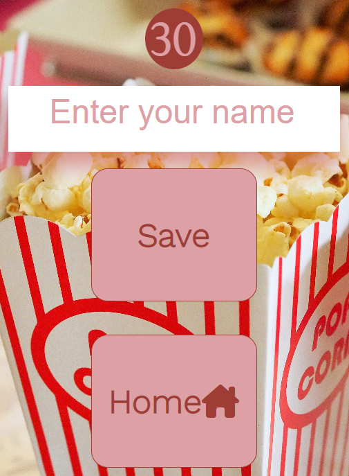

# Lights, Camera, Quiz Time

This website provides an interavtive quiz with 6 different categories of movie genre for the user to choose. The user will be asked 5 questions in each category and their score will be displayed and stored at the end of each category.

## User experience
### User Stories
- First Time Vistor Goals
1. I want to play an interactive game where I can see which questions are correct and incorrect.
2. I want to see my score displayed as I play through the games.
3. I want to ensure the site is relieable and the author is a trusted source.

- Returning Visitor Goals
1. I want to play other categories I did not get a chance to on the first visit.
2. I want to beat my original score.
3. I want to access the author's social media accounts to see any other interactive games the author has designed.

- Frequent User Goals
1. I want to replay each of the categories to see have I answered all possible questions.
2. I want to check have other users beaten my top score.
3. I want to check the social media blog posts to see are there any future features being implemented.

- Owner Goal
1. I want to provide a fun and engaging interactive game for users.
2. I want to provide a wide range of questions from a variety of movie genres to engage players of all ages and interests.
3. I want to develop an online presence showcasing my expertise in the area of interactive game design.

### Design

#### Color Scheme

The main colors used are Rosy Brown, Copper, Auburn, Seal brown and Raw umber. The color scheme was chosen by uploading the popcorn image to the [coolors](https://coolors.co/) website and choosing a selection of the colors identified in the popcorn image.

#### Typography
I used [Fontjoy](https://fontjoy.com/) to choose a pairing of the fonts. I choose Work Sans 300 for headings and Cormorant Infant 300 for the body. I used [GoogleFonts](https://fonts.google.com/) for the import link. I used sans-serif as the back-up text font for accessibility.

#### Imagery
The popcorn image was sourced from [Pixabay](https://pixabay.com/) from [Pexels](https://www.pexels.com/) [Image Source](https://www.pexels.com/photo/food-snack-popcorn-movie-theater-33129/).

#### Wireframes
- Home Screen
- Game Screen
- Leaderboard Screen

### Existing Features
- 
The heading displays the title of the movie quiz to the user and has an anchor embedded that when clicked the user returns to the home screen. This provides value to the user as the user can return to the home page with ease from any of the screens.
- 
There are siz categories for the user to choose from. This provides value to the user as many different genres of film are included for the user to choose from. Each of the buttons has a transition hover effect that evokes a positive visual response from the user.
- 
There are links to social media sites for the user to interact with. The links open in an external tab which removes the necessity to click the back button. The inclusion of this feature provides value to the user as they can access the author's social media page to gain insight into the author and confirm the site is a credible and reliable source.
- 
Once the user choses a category they are navigated to the game screen where there is a question and 4 possible options displated to the user. This provides value as the user has options to aid them in answering the question. The addition of the green and red background colors for correct and incorrect selected answers provides the user with a visual stimulus and indication of their progress with the quiz.
- 
The heads up display includes the question the user is currently on and displays the score to the user. The score implements when a user gets a correct answer which is also signified by the temporary green background color which display on the answer box selected. This provides value to the user as it is clear the number of questions they have completed and whether they were successful in answering the questions in the chosen category.
- 
When the user completes the max number of questions they are navigated to the end screen where their score is displayed. The user has the option to complete the form input with their name and save their result or they have the option to return to the home screen and choose another category. If the user chooses to save their score they are then naviagted to a high scores screen where the top 5 high scores are displayed. This provides value to the user as they have the option to save their score if they are happy with their result and encourages competition amongst users to achieve the highest possible score.
- 
The high scores screen displays the top 5 results including the score and the user who achieved the score. The current user can view the results and determine if they have been successful to reach the high scores board. There is also a home button where the user can return to the categories home screen. This screen provides value as it gives a sense of achievement to users.

### Acessibility
- Using semantic header, main and footer elements to aid screen readers.
- Including aria labels for social media clickable links.
- Using an alt attribute for the popcorn image used.
- Using a palette of colors that allow clear contrast for users.
- Using a green background color for correct answers and red color for incorrect answers.
- Using accesible fonts such as work sans for the header and sans-serif for the back-up fonts.

### Languages
- [HTML](https://en.wikipedia.org/wiki/HTML5)
- [CSS](https://en.wikipedia.org/wiki/CSS)
- [JS](https://en.wikipedia.org/wiki/JavaScript)

### Frameworks, Libraries and Programs
1. [Coolors](https://coolors.co/)
- Coolors was used to upload the popcorn image from Pixabay and choose a palette of colors from the colors displayed in the image.
2. [Fontjoy](https://fontjoy.com/)
- Fontjoy was used to choose the font pairing, Work sans and Cormorant Infant 300.
3. [GoogleFonts](https://fonts.google.com/)
- GoogleFonts was used to attain the import link to code in the css file.
4. [Pexels](https://www.pexels.com/)
- Pexels was used to research images suitable for the game site.
5. [Pixabay](https://pixabay.com/)
- The image chosen from the pexels site was sourced from Pixabay.
6. [Balsamiq](https://balsamiq.com/)
- Balsamiq was used to design the wireframes for the interactive game site on mobile, tablet and desktop screen sizes.
7. [FontAwesome](https://fontawesome.com/)
- FontAwesome was used to choose icons and use the html code displayed to insert the chosen icons into the button elements and the footer icons.
8. [Git]()
- Gitpod was used to add commits each time a new feature was added and pushing to Github for future maintainability
9. [Github]()
- Github was used for storing the site after being pushed from Gitpod and for deploying the site.

### Future Features
- 
- 
- 

### Validation and Testing
[W3C HTML Validator](https://validator.w3.org/#validate_by_input)
- 
- 

[W3C CSS Validator](https://jigsaw.w3.org/css-validator/#validate_by_input)
- 
- 
[JS Validator](https://jshint.com/)
- 
- 

### Testing User Stories
First Time Users
1. 
2. 
3. 

### Testing on Browers and Devices
#### Browser Testing
- 
- 
- 
- 
- 

#### Device Testing
- 
- 
- 

#### Lighthouse Testing
- 
- 
- 

### Bugs
#### Solved Bugs
- 
- 

#### Unsolved Bugs
- 
- 

### Deployment
[Github](https://github.com/) was used to deploy the site.
The site is accessible [here]().

#### Instructions
1. Login to github.com
2. Click the project title under the list of repositories.
3. Click on the settings option.
4. Click on pages on the left hand side under the code and automation heading.
5. Under the heading of build and deployment click the branch drop down menu and select main and click save.
6. Refresh the page and a notification will display that your site is now live and click the visit site option.

### Credits
#### Code
- [James Q Quick - Build a Quiz App](https://www.youtube.com/watch?v=zZdQGs62cR8&list=PLB6wlEeCDJ5Yyh6P2N6Q_9JijB6v4UejF&index=3)
This walkthrough YouTube tutorial was used and adapted to write the iteration loops in the displayQuestion function to display the four options associated with each question and to add the loop to add the click event listener to register when a user makes their selected choice.
- [4n4ru CIP2 Guessing Bee](https://github.com/4n4ru/CI-P2-GuessingBee/blob/master/assets/js/guessing-bee.js)
This repository was used and adapted to toggle between the home screen and the game screen.
- [Brian Design - How to Make a Quiz App using HTML, CSS & Javascript](https://www.youtube.com/watch?v=f4fB9Xg2JEY)
This walkthrough Youtube tutorial was used and adapated for the hover effect over the buttons on the home screen and the option divs on the game screen. This walkthrough was also used to calculate the value of the question index in the JS file displayQuestion function and the design of the question bank array.
- [The Love Maths Walkthrough Porject](https://learn.codeinstitute.net/courses/course-v1:CodeInstitute+LM101+2021_T1/courseware/2d651bf3f23e48aeb9b9218871912b2e/78f3c10a937c4fe09640c7c0098d16bd/)
The walkthrough was used and adapted to write the function for when the DOM Content loads and for inspiration on how to use if else statements for the game to choose between a selection of data types and display the appropriate question herein.
- [How to Read a JSON File in JavaScript](https://www.freecodecamp.org/news/how-to-read-json-file-in-javascript/)
This code in this document was used and adapted to fetch the JSON file with the quiz questions and access these question in the JS file specifically in the runGame function.
- [All Things JavaScript LLC Accessing JSON data](https://www.youtube.com/watch?v=Pb-8DzAObmg)
This YouTube tutorial was useful in troubleshooting and fetching the quiz questions and ensuring all questions were being assigned to the correct variables.

#### Content
- All quiz questions and option were written by the developer.

#### Media
- The image file used as a background for the home screen and quiz screen was downloaded from Pexels and sourced by Pixabay.
- 

#### Acknowledgements
- Thank you to my family for testing the site and providing feedback and support throughout the project.
- Thank you to my mentor for the support, positivity and reassurance throughout the project.
- Thank you to the facilitator for providing relevant resources and repositories to aid in the development of the project.